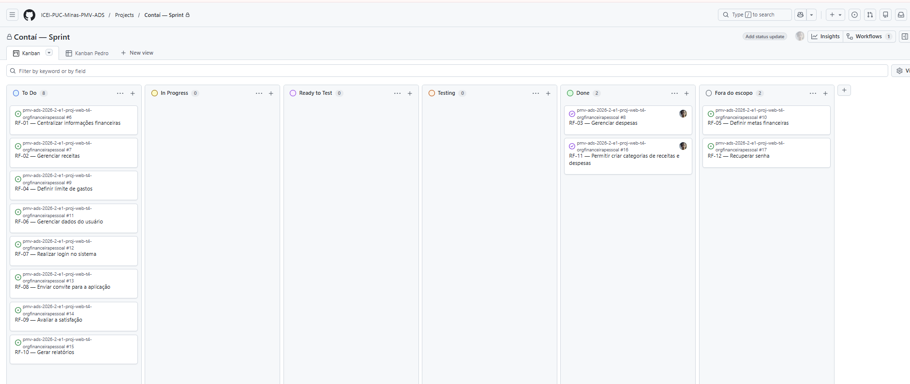

<h1>Metodologia</h1>

Esta seção descreve a organização da equipe para a execução das tarefas do projeto e as ferramentas utilizadas para a manutenção dos códigos e demais artefatos.

<h1>Gerenciamento de Projeto</h1>
A metodologia ágil escolhida para o desenvolvimento deste projeto foi o SCRUM, pois como citam Amaral, Fleury e Isoni (2019, p. 68), seus benefícios são a

“visão clara dos resultados a entregar; ritmo e disciplina necessários à execução; definição de papéis e responsabilidades dos integrantes do projeto (Scrum Owner, Scrum Master e Team); empoderamento dos membros da equipe de projetos para atingir o desafio; conhecimento distribuído e compartilhado de forma colaborativa; ambiência favorável para crítica às ideias e não às pessoas.”

<h1>Divisão de Papéis</h1>

A equipe utiliza o Scrum como base para definição do processo de desenvolvimento.

- Scrum Master: Rainan da Silva Nogueira
- Product Owner: Isaque Gabriel Ribeiro
- Equipe de Desenvolvimento: Rainan da Silva Nogueira, Marlon Fernando de Assis Silva, Isaque Gabriel Ribeiro, Lucas Maciel Rodrigues, Pedro Henrique Oliveira Maia
- Equipe de Design: Marlon Fernando de Assis Silva

<h1>Processo</h1>

Para organizar e acompanhar o desenvolvimento do projeto, a equipe utiliza um quadro Kanban no GitHub. As tarefas são movimentadas entre as colunas de acordo com o estágio em que se encontram:

- **To Do:** reúne as tarefas que ainda não foram iniciadas e que estão previstas para desenvolvimento.
- **In Progress:** contém as tarefas que já foram iniciadas e estão sendo desenvolvidas por algum integrante da equipe.
- **Ready to Test:** reúne as tarefas cujo desenvolvimento foi finalizado e que estão prontas para serem verificadas e testadas.
- **Testing:** contém as tarefas que estão passando por revisão e testes antes de serem consideradas concluídas.
- **Done:** reúne as tarefas já finalizadas, revisadas e consideradas concluídas pela equipe.
- **Fora do escopo:** reúne requisitos que permanecem registrados no projeto, mas que não serão desenvolvidos nesta etapa.

A Figura abaixo apresenta o quadro Kanban utilizado pela equipe para acompanhar o andamento dos requisitos e visualizar a situação atual de cada tarefa do projeto.

<h1>Etiquetas</h1>

As tarefas do projeto também são classificadas por meio de etiquetas, de acordo com a natureza da atividade. Foram utilizadas as seguintes categorias:

- **Bug:** utilizada para identificar erros no sistema ou no código.
- **Documentação:** utilizada em tarefas relacionadas à criação ou atualização da documentação do projeto.
- **Development:** utilizada para atividades de desenvolvimento de funcionalidades.
- **Tests:** utilizada para tarefas de testes e revisões das funcionalidades.
- **Project Management:** utilizada para atividades de organização e gerenciamento do projeto.
- **Enhancement:** utilizada para identificar novas funcionalidades ou melhorias.

<figure> 
   A Figura acima apresenta a tela do esquema de cores e categorias</figcaption>
</figure> 
  
<h1>Ferramentas</h1>

Os artefatos do projeto são desenvolvidos a partir de diversas plataformas e a relação dos ambientes com seu respectivo propósito é apresentada na tabela que se segue.

| AMBIENTE                            | PLATAFORMA                         | LINK DE ACESSO                         |
|-------------------------------------|------------------------------------|----------------------------------------|
| Repositório de código fonte         | GitHub                             | https://github.com/ICEI-PUC-Minas-PMV-ADS/pmv-ads-2026-2-e1-proj-web-t4-orgfinanceirapessoal/tree/main/codigo-fonte |
| Documentos do projeto               | GitHub                             | https://github.com/ICEI-PUC-Minas-PMV-ADS/pmv-ads-2026-2-e1-proj-web-t4-orgfinanceirapessoal/tree/main/documentos |
| Projeto de Interface                | Canvas                              | https://canva.link/bvxk278x8qv11ye                            |
| Gerenciamento do Projeto            | GitHub Projects                    | https://github.com/orgs/ICEI-PUC-Minas-PMV-ADS/projects/3120 |
| Hospedagem                          | GitHub Pages                       | http://....                            |

<h1>Estratégia de Organização de Codificação</h1>

Todos os artefatos relacionados a implementação e visualização dos conteúdos do projeto do site são inseridos na pasta [codigo-fonte](https://github.com/ICEI-PUC-Minas-PMV-ADS/WebApplicationProject-Template-v2/tree/main/codigo-fonte). [Consulte a nossa sugestão referente a estratégia de organização de codificação a ser adotada pela equipe de desenvolvimento do projeto.]
