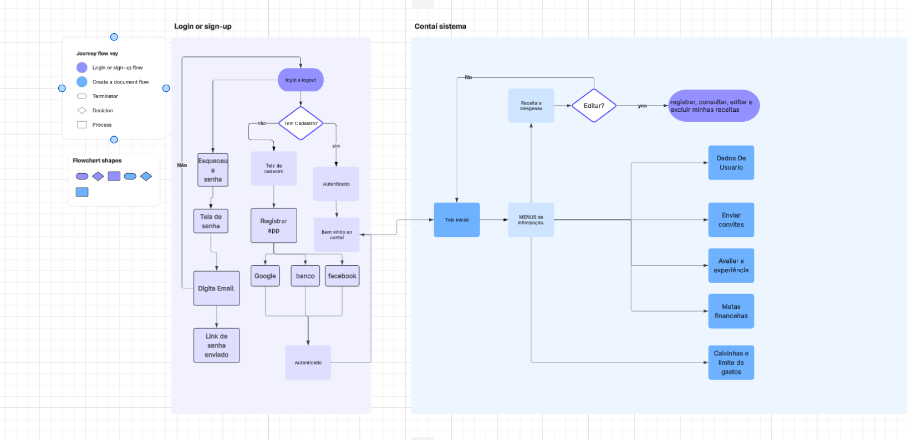
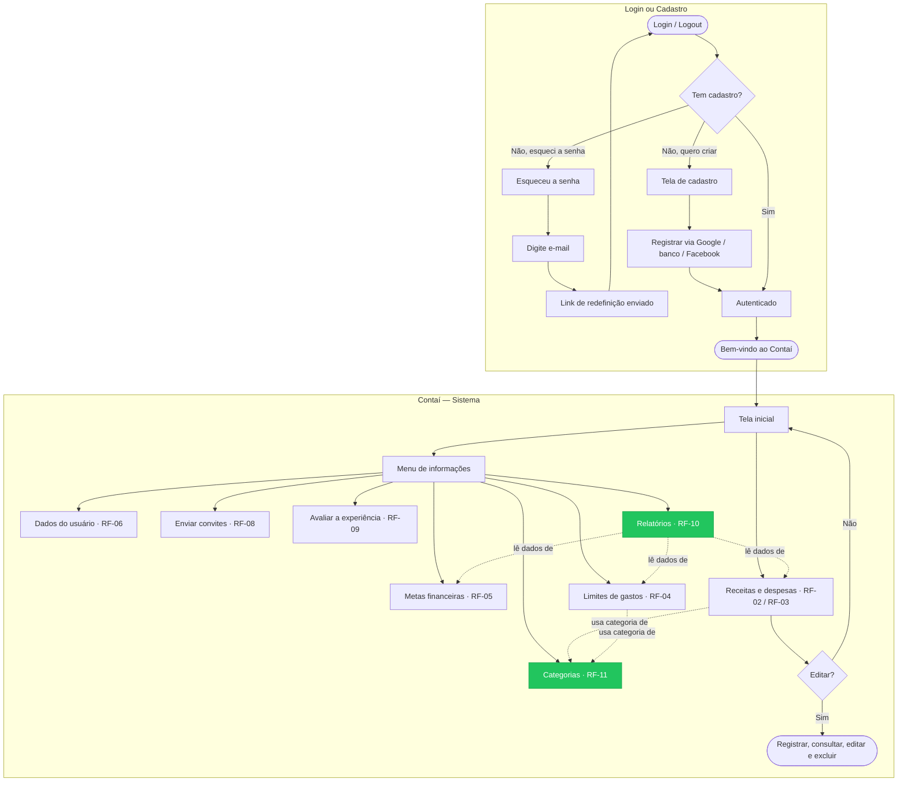

# Projeto de Interface

## User Flow

Isaque

Marlon

Pedro
### User Flow — versão completa (com RF-10 e RF-11)

O diagrama acima não incluía as telas de **Categorias (RF-11)** e **Relatórios (RF-10)**,
que já constam em `02-Especificação do Projeto.md`. Abaixo vai a mesma jornada, completa,
em Mermaid (o GitHub renderiza automaticamente ao abrir este arquivo):

**O que foi adicionado** (verde no diagrama):
- **Categorias (RF-11)** — acessível pelo menu, e usada tanto por Receitas/Despesas quanto por Limites (toda despesa/receita e todo limite têm uma categoria).
- **Relatórios (RF-10)** — acessível pelo menu, e lê dados de Receitas/Despesas, Limites e Metas para gerar as visualizações.

## Protótipo

Desenvolver um protótipo emerge como uma das maneiras mais ágeis e econômicas de validar uma ideia, conceito ou funcionalidade. Isso permite a interação, avaliação, modificação e aprovação das principais características de uma interface antes de entrar na fase de desenvolvimento. [Leia o artigo [Protótipos: baixa, média ou alta fidelidade?](https://medium.com/ladies-that-ux-br/prot%C3%B3tipos-baixa-m%C3%A9dia-ou-alta-fidelidade-71d897559135).]

### Protótipo de baixa fidelidade

Protótipos de baixa fidelidade apresentam de forma simplificada o design da interface e o relacionamento entre suas páginas, permitindo evolução da proposta da solução. Neste projeto, os utilizaremos para apoiar a validação dos requisitos e efetuar mudanças dos mesmos, caso seja necessário, para menor impacto na codificação da aplicação.

[Elabore as principais interfaces gráficas da aplicação de modo que os requisitos funcionais sejam contemplados nas telas propostas.]

[Adicione aqui as telas da sua aplicação com seus devidos títulos.] 
 
> **Links Úteis**:
> - [Protótipos vs Wireframes](https://www.nngroup.com/videos/prototypes-vs-wireframes-ux-projects/)
>- Ferramentas:
>> - [Pencil](https://pencil.evolus.vn/)
>> - [MarvelApp](https://marvelapp.com/)
>> - [Figma](https://www.figma.com/)

