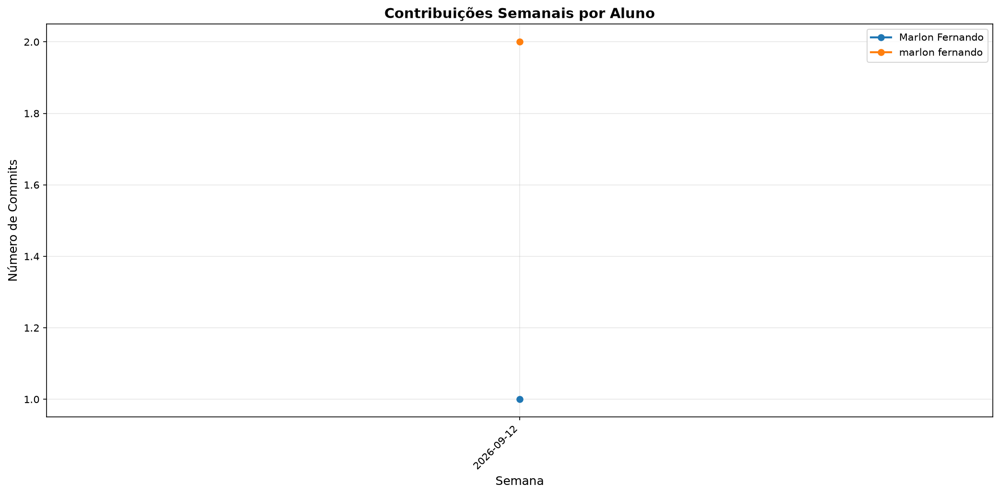

# 📊 Relatório de Contribuições do Projeto

**Última atualização:** 19/09/2026 18:00

---

## 📈 Resumo Geral de Contribuições

| Aluno           |   Commits |   Linhas+ |   Linhas- |   Arquivos |   Docs Commits |   Docs Arquivos |
|-----------------|-----------|-----------|-----------|------------|----------------|-----------------|
| Marlon Fernando |         1 |      2672 |         0 |         51 |              1 |               1 |
| marlon fernando |         2 |      3875 |      2625 |        115 |              1 |               5 |

## 📅 Contribuições Semanais (Todo o Semestre)

**2026-09-12**: Marlon Fernando: 1, marlon fernando: 2

## 📊 Visualização Gráfica

## ℹ️ Observações

- **Commits**: Número total de commits realizados

- **Linhas+**: Linhas de código adicionadas

- **Linhas-**: Linhas de código removidas

- **Arquivos**: Número de arquivos únicos modificados

- **Docs Commits**: Commits em arquivos de documentação

- **Docs Arquivos**: Arquivos de documentação modificados

---

*Relatório gerado automaticamente via GitHub Actions*
