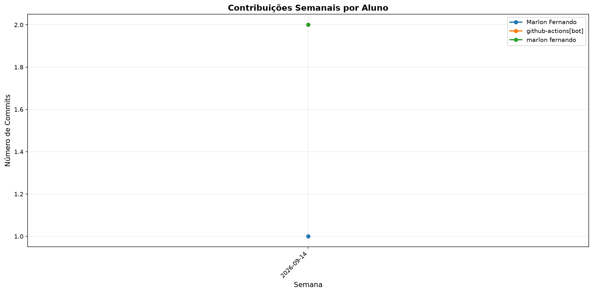

# 📊 Relatório de Contribuições do Projeto

**Última atualização:** 05/10/2026 04:19

---

## 📈 Resumo Geral de Contribuições

| Aluno               |   Commits |   Linhas+ |   Linhas- |   Arquivos |   Docs Commits |   Docs Arquivos |
|---------------------|-----------|-----------|-----------|------------|----------------|-----------------|
| Marlon Fernando     |         1 |      2672 |         0 |         51 |              1 |               1 |
| github-actions[bot] |         3 |        16 |        24 |          3 |              3 |               1 |
| marlon fernando     |         2 |      3875 |      2625 |        115 |              1 |               5 |

## 📅 Contribuições Semanais (Todo o Semestre)

**2026-09-21**: github-actions[bot]: 1

**2026-09-14**: Marlon Fernando: 1, github-actions[bot]: 2, marlon fernando: 2

## 📊 Visualização Gráfica

## ℹ️ Observações

- **Commits**: Número total de commits realizados

- **Linhas+**: Linhas de código adicionadas

- **Linhas-**: Linhas de código removidas

- **Arquivos**: Número de arquivos únicos modificados

- **Docs Commits**: Commits em arquivos de documentação

- **Docs Arquivos**: Arquivos de documentação modificados

---

*Relatório gerado automaticamente via GitHub Actions*
